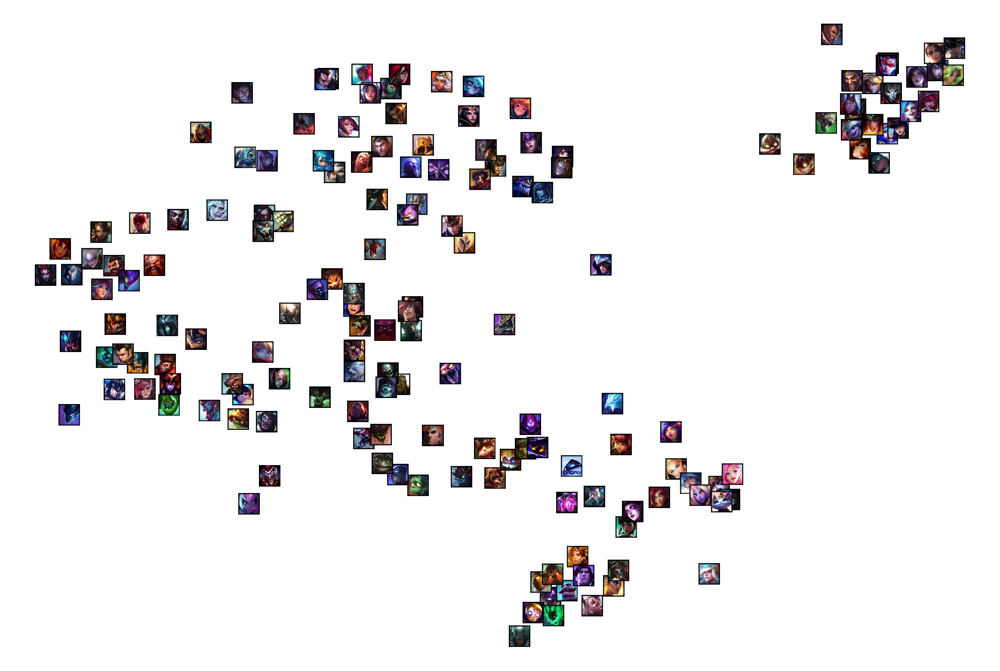

# LoL Champion Embedding

League of legend champion embedding with similarity learning based on user preference

## Method
### 1. Get summoner ids

Crawling from [op.gg](https://op.gg/leaderboards/tier/) ranking page with Celenium

### 2. Save the summoner's unique id and mastery point in DB

Used [RiotAPI](https://developer.riotgames.com/apis/) and SQLite

### 3. Train champion embedding based on the similarity score

When a player plays champions for many times, we consider them to be similar

### 4. Visualize champions

Visualize the embedding vector of each champion by dimensionality reduction method (t-SNE showed reliable result)

## Result

Visualization with TSNE:


## How to use

```
python get_name.py
python get_id.py
python get_masteryinfo.py
python embedding.py
```

## Reference

[WillKoehrsen's work](https://github.com/WillKoehrsen/wikipedia-data-science/blob/master/notebooks/Book%20Recommendation%20System.ipynb)

[giantZorg's work](https://github.com/giantZorg/Lol_champion_embeddings)
