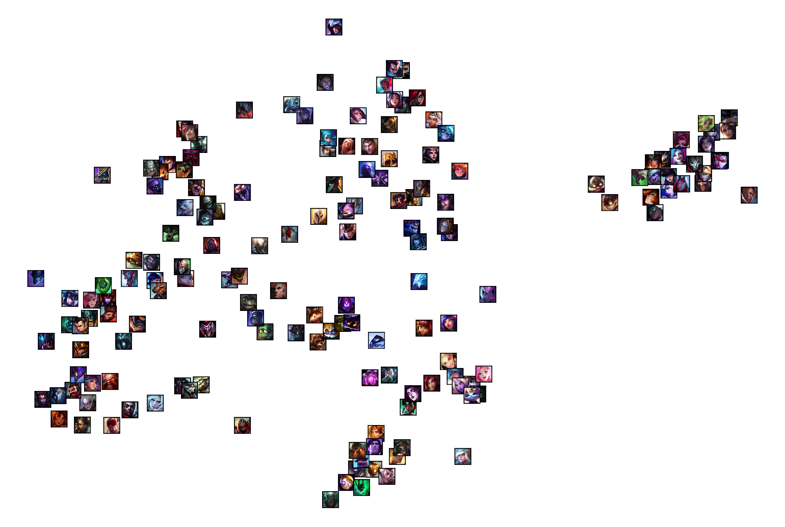

# LoL Champion Similarity

Visualize league of legend champion similarity based on user play tendency

## Method
### 1. Get summoner ids

Crawling from [op.gg](https://op.gg/leaderboards/tier/) ranking page with Celenium

### 2. Save the summoner's unique id and mastery point in DB

Used [RiotAPI](https://developer.riotgames.com/apis/) and SQLite

### 3. Train champion embedding based on the similarity score

When a player plays champions for many times, we consider them to be similar

### 4. Visualize champions

Visualize the embedding vector of each champion by dimensionality reduction method (t-SNE showed reliable result)

## Result

Visualization with TSNE:


The champions with similar roles (i.e. 'position') are clustered well.

## Demo

```
python embedding.py
```
The resulting visualization will be saved in the `/results/` folder.

## Training details

Our neural network stores learnable champion embedding vectors with a certain dimension using [`nn.Embedding()`](https://pytorch.org/docs/stable/generated/torch.nn.Embedding.html).
```python
nn.Embedding(num_of_embeddings = number of total champion, embedding_dim = target embedding dimension)
```
Our network gets two champion ids as input and returns the dot product (similarity) of two champion embedding vectors.

We get the ground-truth similarity score of two champions from real play data. Then we train the network with MSE loss between GT and the dot product of two embedding vectors.

* GT similarity score will differ depending on the user, so the network has a weakness in outlier data. To minimize it, we use a large batch size (large user data) for each optimization step. 

## Reference

[WillKoehrsen's work](https://github.com/WillKoehrsen/wikipedia-data-science/blob/master/notebooks/Book%20Recommendation%20System.ipynb)

[giantZorg's work](https://github.com/giantZorg/Lol_champion_embeddings)
